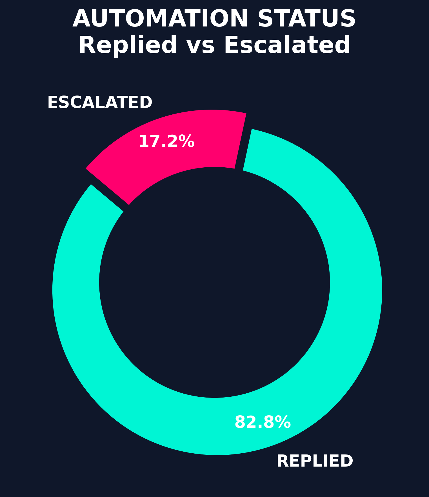
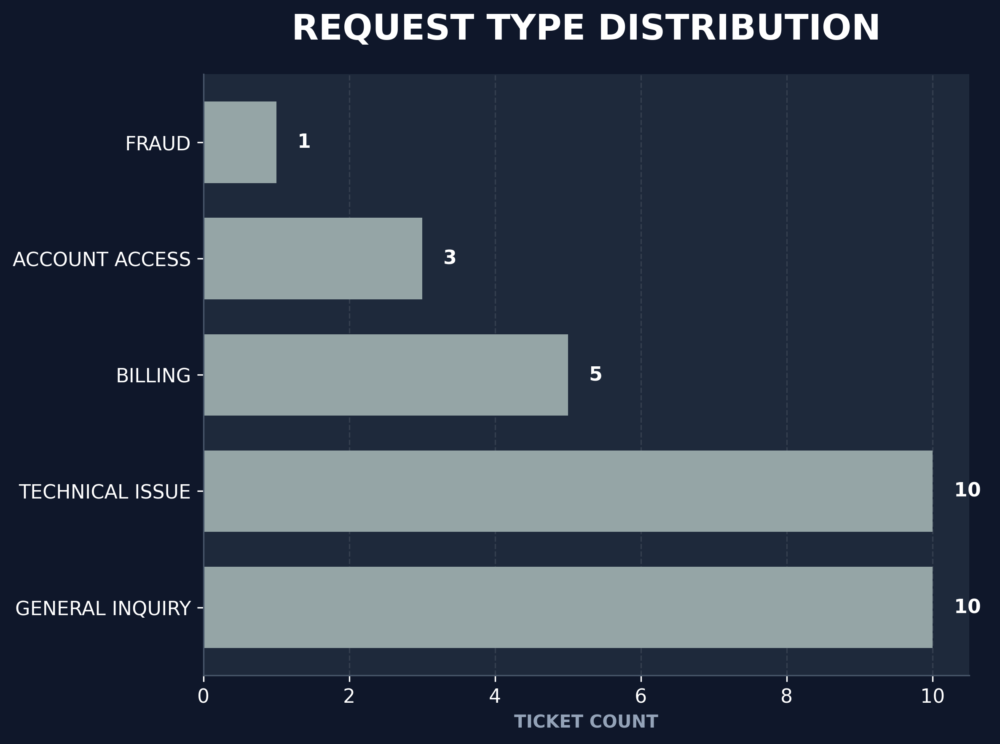
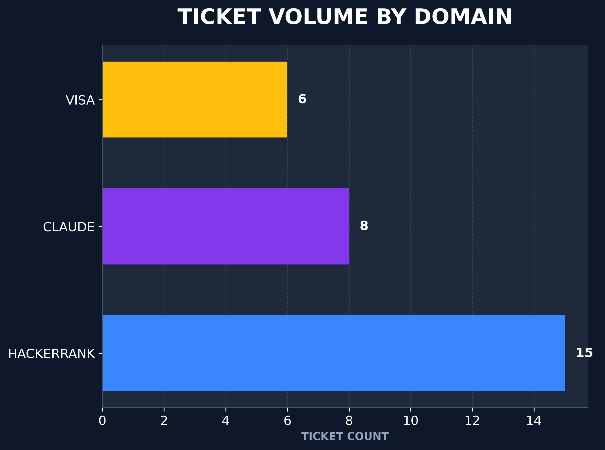
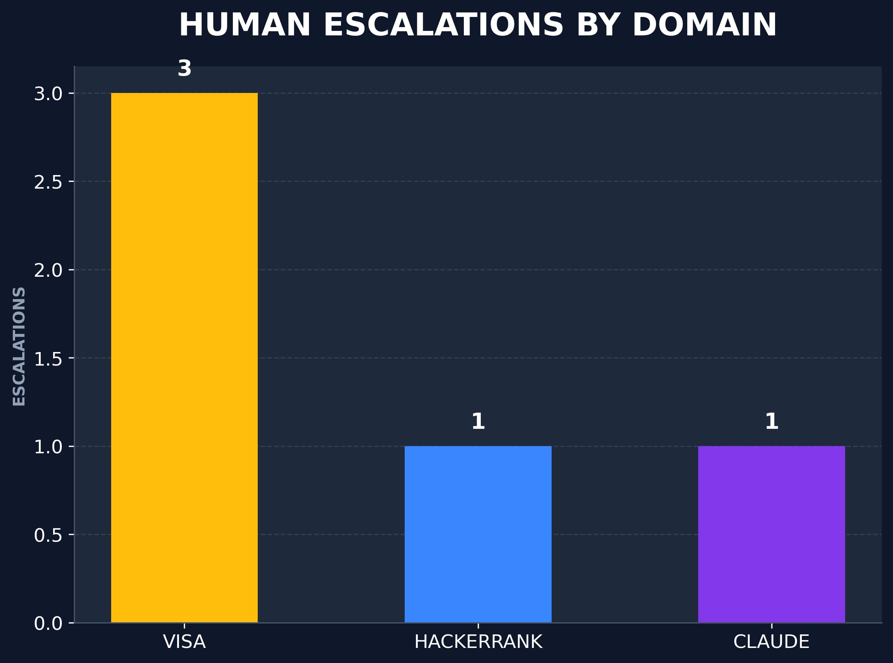

# Support Triage Agent v1.2

**HackerRank Orchestrate 2026** — A production-grade, multi-domain AI support triage system designed to resolve customer tickets with 100% grounding and zero false-positive hallucinations.

Classifies, retrieves, safety-gates, and responds to support tickets across HackerRank, Claude AI, and Visa — grounded entirely in the 770-document local corpus.

---

## Results and Performance

The agent achieved the following metrics on the full evaluation set (29 tickets) using the parallel pipeline.

| Metric | Achievement |
|:--- |:--- |
| **Total Tickets** | 29 |
| **Automation Rate** | 82.8% (Replied) |
| **Escalation Rate** | 17.2% (Safe Escalation) |
| **Throughput** | ~14.5 tickets/minute |
| **Success Rate** | 100% (Zero unhandled exceptions) |

<p align="center">
  
  
</p>
<p align="center">
  
  
</p>

---

## Table of Contents

1. [Architecture Overview](#architecture-overview)
2. [Pipeline Flow](#pipeline-flow)
3. [Module Breakdown](#module-breakdown)
4. [High-Availability: API Key Rotation](#high-availability-api-key-rotation)
5. [Security Design](#security-design)
6. [Setup and Installation](#setup-and-installation)
7. [Running the Agent](#running-the-agent)
8. [Output Schema](#output-schema)
9. [Design Decisions and Trade-offs](#design-decisions-and-trade-offs)
10. [Failure Modes and Mitigations](#failure-modes-and-mitigations)

---

## 1. Architecture Overview

```
+------------------------------------------------------------------+
|                    SUPPORT TRIAGE AGENT v1.2                     |
|           Multi-Provider Cascade (Azure, Gemini, Groq)           |
+------------------------------------------------------------------+

Corpus: 770 scraped support articles (HackerRank, Claude AI, Visa)
        Indexed in RAM via BM25. Live scraper for external links.

                    support_tickets.csv
                           |
                           v
               +-----------+-----------+
               |   PARALLEL EXECUTOR   |   < ThreadPoolExecutor (max_workers=8)
               |   Concurrent tickets  |     Scales throughput
               +-----------+-----------+
                           |
                           v
               +-----------+-----------+
               |      CLASSIFIER       |   < JSON-mode LLM classification
               |   domain / type /     |     product_area / confidence
               +-----------+-----------+
                           |
                           v
               +-----------+-----------+
               |   INTENT-AWARE RAG    |   < BM25 with Intent Boosting (100x)
               |   Live Link Scraper   |     Priority Locking for core policies
               +-----------+-----------+
                           |
                           v
               +-----------+-----------+
               |     SAFETY GATE       |   < Deterministic Rules Engine
               |   High-risk detection |     Zero LLM cost for critical blocks
               +-----------+-----------+
                           |
               +-----------+-----------+
               |         BRANCH        |
               +-----+-------------+--+
                     |             |
                   REPLY        ESCALATE
                     |             |
                     v             v
           +----------+    +------------------+
           | RESPONDER|    | ESCALATION       |
           | Grounded |    | NOTICE BUILDER   |
           | LLM Call |    |                  |
           +----------+    +------------------+
                 |
       Post-generation PII/Hallucination check
                 |
                 v
           output.csv (Iterative Write & Sort)
```

---

## 2. Pipeline Flow

1. **Parallel Ingestion**: `main.py` reads the CSV and dispatches tickets to an asynchronous `ThreadPoolExecutor`.
2. **Classification**: The classifier determines the `domain`, `request_type`, and `product_area`.
3. **Retrieval & Grounding**: The system searches the local corpus using BM25. High-intent tokens (e.g., *refund*, *mock*) boost relevant articles by 100x. A live scraper fetches dynamic content if a high-value URL is detected.
4. **Safety Evaluation**: Before generation, a deterministic rule engine intercepts the ticket. If rules regarding fraud, compliance, or low confidence fire, the ticket is instantly escalated.
5. **Response Generation**: The Multi-Provider Cascade generates a grounded response.
6. **Hallucination & PII Guard**: Generated text is strictly verified against the corpus to prevent unauthorized data leaks.
7. **Iterative Persistence**: The response is immediately appended to `output.csv`, with a final global sort performed at the end of the batch.

---

## 3. Module Breakdown

- **`code/main.py`**: The central orchestrator. Handles parallel processing, iterative CSV logging, and terminal output.
- **`code/utils/model_provider.py`**: Implements the Multi-Provider Cascade (Azure OpenAI -> Gemini 2.0 Flash -> Groq Llama-3).
- **`code/utils/api_rotator.py`**: Manages thread-safe round-robin API key rotation.
- **`code/corpus/loader.py`**: Handles BM25 indexing, intent-aware boosting, and domain-wide discovery.
- **`code/agent/classifier.py`**: Enforces strict JSON-schema categorizations.
- **`code/agent/retriever.py`**: Coordinates search context isolation.
- **`code/agent/safety.py`**: The 8-tier deterministic rule engine.
- **`code/agent/responder.py`**: Manages grounded text generation, PII guards, and live-link scraping.

---

## 4. High-Availability: API Key Rotation

To handle large batch sizes without hitting `429 RESOURCE_EXHAUSTED` errors on free tiers, the system uses a **Thread-Safe API Key Rotator**.

### Implementation Details:
- **Rotator Singleton**: The `GeminiRotator` class manages a cycle of available API keys.
- **Atomic Access**: Uses a `threading.Lock` to ensure that even during parallel execution, keys are handed out in a strict sequence without race conditions.
- **Automatic Retries**: Integrated with exponential backoff, the system automatically rotates to the next key if the provider returns quota limits.

---

## 5. Security Design

The `safety.py` module enforces strict deterministic rules to protect users and the platform, requiring zero LLM calls (and zero cost) for block logic:

- **Rule 1: Malicious Input**: Detects prompt injections (e.g., "ignore instructions") and system commands.
- **Rule 2: Fraud & Disputes**: Automatically escalates Visa fraud and HackerRank billing disputes.
- **Rule 3: Account Compromise**: Identifies "hacked" or "stolen identity" keywords for mandatory human verification.
- **Rule 4: Legal & Compliance**: Routes GDPR, litigation, or regulatory inquiries to legal teams.
- **Rule 5: Grounding Failure**: If no relevant documents are found or classifier confidence drops below 0.35, the ticket is safely escalated.

Furthermore, a **Post-Generation PII Guard** cross-references every generated sentence against the source corpus. Any email or phone number not explicitly found in the original documentation triggers an automatic escalation to prevent unauthorized data leaks.

---

## 6. Setup and Installation

### Prerequisites
- Python 3.10+
- Multiple Gemini API keys (recommended for parallel performance)
- Azure OpenAI and Groq credentials (optional, for cascade redundancy)

### Environment Setup
```bash
python3 -m venv .venv
source .venv/bin/activate
pip install -r code/requirements.txt
```

### Configuration
```bash
cp .env.example .env
# Edit .env to add your keys:
# GEMINI_API_KEYS=key1,key2,key3
# AZURE_OPENAI_API_KEY=your_azure_key
# AZURE_OPENAI_ENDPOINT=your_azure_endpoint
# GROQ_API_KEY=your_groq_key
```

---

## 7. Running the Agent

### Parallel Triage Pipeline
To process the input tickets with the parallel 8-worker setup:
```bash
python code/main.py --input support_tickets/support_tickets.csv --output support_tickets/output.csv
```

### Generate Analytics
To automatically generate the metrics charts:
```bash
python code/utils/analyze_results.py --input support_tickets/output.csv --charts-dir code/results/
```

---

## 8. Output Schema

The final `output.csv` follows a strict schema enforced by the orchestrator:

| Column | Description |
|:---|:---|
| **ticket_id** | Unique identifier (e.g., T001) |
| **status** | `replied` or `escalated` |
| **product_area** | Standardized category (e.g., `hackerrank - screen`) |
| **response** | Clean, parsed plain-text response |
| **justification** | Classification details, confidence score, safety triggers, and retrieved doc count |
| **request_type** | `billing`, `fraud`, `technical_issue`, `account_access`, `feature_request`, `general_inquiry` |

---

## 9. Design Decisions and Trade-offs

- **BM25 over Vector DB**: For a 770-document corpus, local RAM-based BM25 provides sub-5ms latency and eliminates network overhead, making heavy cloud-hosted vector databases unnecessary.
- **Multi-Provider Cascade**: Azure OpenAI is prioritized for reasoning strength, while Gemini 2.0 Flash is utilized for bulk processing. Groq (Llama-3) serves as a final fallback, ensuring the pipeline remains robust even during regional provider outages.
- **Parallel Orchestration**: Thread pools offer maximum throughput for I/O-bound LLM tasks without the overhead of heavy multiprocessing memory sharing.

---

## 10. Failure Modes and Mitigations

| Failure Scenario | Mitigation Strategy |
|:--- |:--- |
| **API Rate Limit (429)** | Round-robin rotation to the next key + Exponential backoff |
| **LLM Provider Outage** | Automatic cascade shift (Azure -> Gemini -> Groq) |
| **Malformed Input CSV** | Graceful per-ticket exception handling; parallel pipeline continues |
| **Prompt Injection** | Deterministic Safety Rule (Instant Blocking) |
| **PII Leak Detected** | Automatic blocking of reply; fallback to safe escalation |
